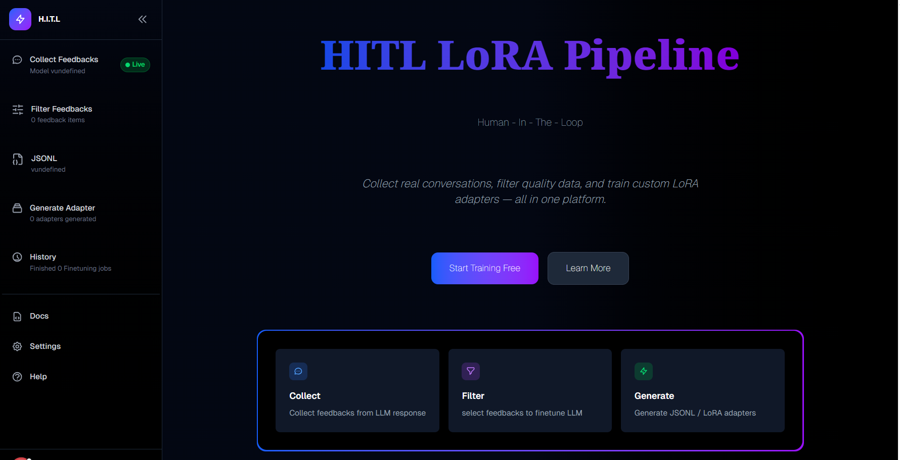
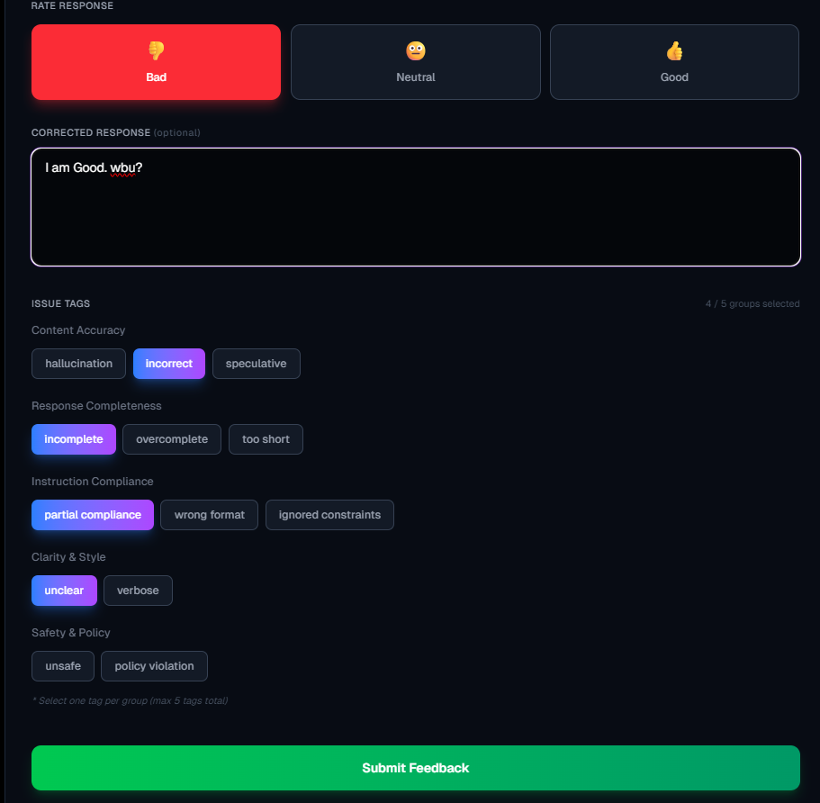
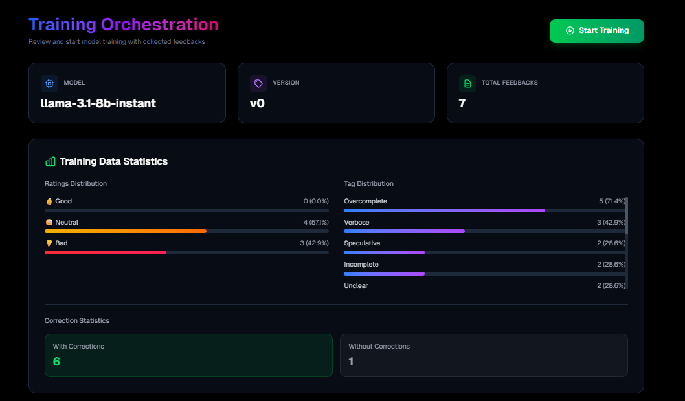
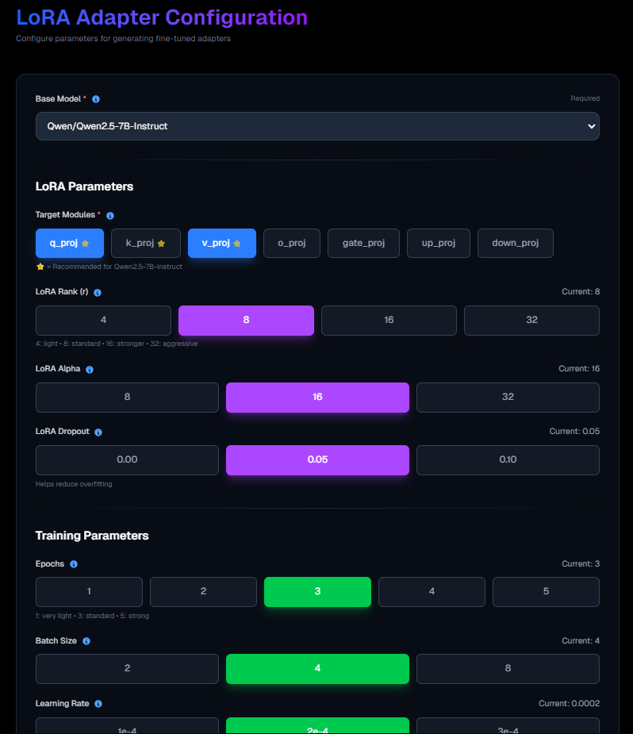
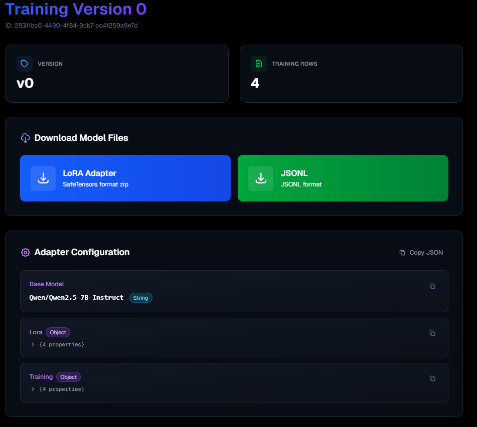

# 🧠 HITL LoRA Fine-Tuning Platform

**A Human-in-the-Loop LoRA factory where feedback becomes fuel for continuous model improvement.**

This platform lets organizations collect real user feedback, curate datasets, and generate LoRA adapters on-demand using GPU jobs, without retraining full models.

  

---

## 📚 Table of Contents
- [About](#about)
- [Features](#features)
- [Base Models](#base-models)
- [Docs](#docs)
- [Contact](#contact)

---

## About

This project is built around a simple but powerful idea:

> **One feedback collection → One JSONL dataset → One LoRA adapter**

Instead of retraining massive models repeatedly, this system:
- Captures real corrections from users during chat
- Cleans and validates feedback automatically
- Converts feedback into structured JSONL datasets
- Users configure finetuning parameters 
- Trains lightweight **LoRA adapters** using GPU jobs
- Maintains history of LoRA adapters with dataset and parameters

---

## Features

### 🔁 Chat & Feedback Loop
- Live chat with deployed model
- Capture user corrections inline
- Feedback stored with tags

  

---

### 🧪 Dataset Builder
- View, filter, and delete feedback
- Know dataset behaviour
- Generate cleaned JSONL automatically

  

---

### ⚙️ Training Orchestration
- Configure LoRA parameters
- Trigger GPU training jobs
- Track training lifecycle states

  

---

### 🧩 Model Registry
- Versioned training history
- Adapter metadata & status

  

---

### ☁️ GPU Training via Modal
- Serverless GPU jobs
- Minimal GPU usage (QLoRA)
- Automatic artifact generation

  

---

## Base Models

The platform currently supports fine-tuning on the following base models:

- **Meta Llama 3 8B Instruct**
- **Mistral 7B Instruct v0.2**
- **Qwen 2.5 7B Instruct**

> we will increase the list. Only vetted models are allowed to ensure licensing safety and predictable GPU usage.

---

## Docs

Explore 
 **[Project Documentation](https://hitl-fine-tuning-service.vercel.app/docs)**
  to get started with your LLM setup and perform PEFT using LoRA adapters. You will find step by step guide to finetune using custom dataset using QLoRA.

Includes:
- PEFT
- LoRA, QLoRA
- Training states
- LoRA configuration guide
- FAQ

---

## Contact
We've made every effort to implement all the main aspects of the OpenID protocol in the best possible way. However, the development journey doesn't end here, and your input is crucial for our continuous improvement.

📧 **Email**: shubhanshsharma030604@gmail.com  

  

---

> Built as a production-grade HITL system for scalable, responsible LLM fine-tuning.
